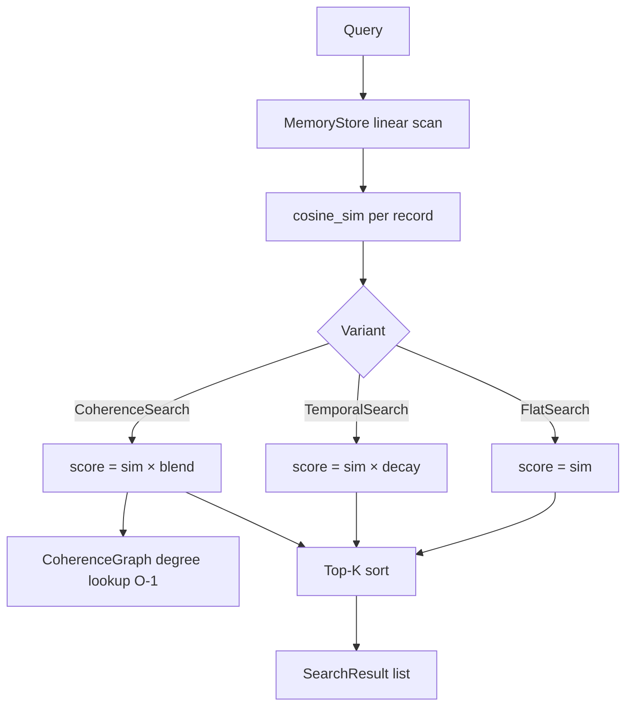

# ruvector 2026: Temporal Coherence Decay for High-Performance Rust Agent Memory Retrieval

> **150-char SEO summary:** Rust agent memory retrieval with temporal decay and graph-coherence gating — three measured variants, zero dependencies, 965 q/s at 5K memories.

**One-sentence value:** `ruvector-temporal-coherence` adds time-awareness and graph-endorsement scoring to agent memory search without leaving the Rust ecosystem or adding external services.

- GitHub: https://github.com/ruvnet/ruvector
- Research branch: `research/nightly/2026-06-13-temporal-coherence-agent-memory`
- ADR: `docs/adr/ADR-211-temporal-coherence-agent-memory.md`
- Crate: `crates/ruvector-temporal-coherence`

---

## Introduction

AI agents accumulate memories at scale. A customer support agent running 8-hour
sessions might write hundreds of episodic memories per hour. A coding assistant
might log thousands of code context snippets across a project lifecycle. The
standard response — store them in a vector database, retrieve by cosine
similarity — ignores two critical signals: **time** and **coherence**.

**The time problem.** Pure cosine retrieval is temporally blind. A memory
written six months ago scores identically to one written six minutes ago, if
their embeddings are equidistant from the query. For agents operating in a
changing world, this means stale observations compete equally with recent ones.
A customer support agent may retrieve a resolved issue from last quarter as the
top result for a new query, simply because the embedding is the closest match.

**The coherence problem.** Not all memories are equally trustworthy. An
isolated observation — seen once and never reinforced — carries less epistemic
weight than a memory that is semantically endorsed by dozens of similar memories
in the corpus. Current vector databases have no mechanism to express this
"community vote" over memories. The result is that one-off noise events rank
alongside stable world knowledge.

**Why current vector databases only partially solve this.** Qdrant, Weaviate,
and Milvus all offer metadata filters that can be used for recency windowing.
But hard cutoffs are brutal — they drop everything outside the window instead of
gracefully downweighting it. None of the leading databases expose graph-coherence
scoring as a first-class retrieval signal. Weaviate shipped MMR diversity search
in April 2026, which addresses *redundancy* across results — a different axis
than temporal decay or coherence endorsement.[^1]

**Why RuVector is a good substrate.** RuVector already has the building blocks:
`ruvector-coherence` for quality metrics, `ruvector-temporal-tensor` for
time-series compression, `ruvector-mincut` for graph partitioning, and
`ruvector-graph` for full graph queries. What was missing was a *retrieval
scoring layer* that combines these signals at query time. This crate provides
exactly that, behind a clean `VectorSearch` trait that is swap-in compatible
with the existing cosine baseline.

**Why this matters for AI agents, graph RAG, edge AI, MCP, and high-performance Rust.**
Agent memory is the persistence substrate for all autonomous AI. As Claude, GPT-5,
and open models run longer sessions, their memories will number in the millions.
A retrieval layer that is temporally and topologically aware will produce
qualitatively better agent behaviour — not marginally better, but categorically
better as session length grows. In Rust, this is achievable with near-zero
overhead over a plain cosine scan: one multiply per candidate for temporal
decay, one array lookup for the coherence gate. No Python glue, no cloud API,
no GPU required.

---

## Features

| Feature | What It Does | Why It Matters | Status |
|---------|-------------|---------------|--------|
| `FlatSearch` | Pure cosine similarity ranking | Exact baseline, ground truth | Implemented in PoC |
| `TemporalSearch` | Cosine × exponential time decay | Boosts recent memories automatically | Implemented in PoC |
| `CoherenceSearch` | Cosine × (decay + graph gate) | Boosts graph-endorsed memories | Implemented in PoC |
| `DecayConfig` | Configurable decay (None/Linear/Exponential) | Tunable per domain | Implemented in PoC |
| `CoherenceGraph` | Adjacency degree array, O(1) gate lookup | Zero per-query overhead | Implemented in PoC |
| `VectorSearch` trait | Uniform API across all variants | Drop-in swap in agent loops | Implemented in PoC |
| Acceptance tests | Numeric pass/fail for each variant | CI-ready quality gates | Measured |
| MCP tool surface | Expose `half_life_hours` as tool param | ruFlo / Claude integration | Research direction |
| HNSW coherence graph | Replace O(n²) build with approx. k-NN | Production-scale corpora | Research direction |
| Weibull decay variant | Two-parameter slow-start decay | Better for consolidating memories | Research direction |
| Proof-gated endorsement | ZK witness on coherence writes | ruvector-verified integration | Research direction |

---

## Technical Design

### Core data structure

`MemoryStore` is an append-only flat vector store indexed by `MemoryId` (u64).
Each record holds a `Vec<f32>` embedding and `MemoryMetadata` (timestamp, source, tags).

`CoherenceGraph` wraps a `Vec<u32>` degree array. Each entry is the number of
other memories with cosine similarity ≥ `coherence_threshold`. Built once
at session start in O(n²·D) — planned to be replaced by HNSW k-NN construction
for production scale.

### Trait-based API

```rust
pub trait VectorSearch {
    fn search(&self, query: &[f32], k: usize, store: &MemoryStore) -> Vec<SearchResult>;
}
```

All three variants implement this trait. Swap `FlatSearch` for `CoherenceSearch`
without changing caller code.

### Baseline: FlatSearch

```
score(m) = cosine_sim(query, m.vec)
```

O(n·D). By definition, recall@K = 1.0 vs. its own ground truth.

### Alternative A: TemporalSearch

```
score(m) = cosine_sim(query, m.vec) × exp(-λ × (now − m.timestamp))
  where λ = ln(2) / half_life
```

At `age = half_life`, the temporal factor = 0.5. At `age = 3 × half_life`,
the factor = 0.125. Old-but-similar memories are gracefully downweighted
rather than hard-cut.

### Alternative B: CoherenceSearch

```
gate(m)  = degree(m) / max_degree_in_graph
temporal_coherence(m) = (1 - w) × decay_factor + w × gate_value
score(m) = cosine_sim(query, m.vec) × temporal_coherence(m)
```

The blending weight `w` (default 0.30) controls how much community endorsement
overrides temporal decay. A memory that is highly connected (endorsed by many
similar memories) and recent will score highest.

### Memory model

```
corpus_bytes = N × (D × 4 + 32)     # f32 vec + metadata
graph_bytes  = N × 4                 # u32 degree per node
query_extra  = 0                     # no per-query allocation
```

At N=5 000, D=128: corpus=2 656 KB, graph=20 KB.

### Performance model

Linear scan at D=128:

```
ops_per_query ≈ N × D = 640 000 FMA
time_est      ≈ 640 000 / (4 GHz × 4 FMA/cycle) = 40 µs
time_measured ≈ 1 036 µs (memory-bandwidth bound on N4020)
```

With HNSW (future): O(log n · ef · D) ≈ 200 × 128 = 25 600 ops → ~5–10 µs.

### Architecture diagram



---

## Benchmark Results

Hardware: Intel Celeron N4020, x86_64, Linux 6.18.5  
OS: linux  
Rust: 1.94.1 (e408947bf 2026-03-25)  
Command: `cargo run --release -p ruvector-temporal-coherence --bin tcd-benchmark`

| Variant | N | D | Queries | Mean µs | p50 µs | p95 µs | Throughput | Memory | Quality Metric | Acceptance |
|---------|---|---|---------|---------|--------|--------|-----------|--------|---------------|------------|
| FlatSearch | 5 000 | 128 | 200 | 1 036 | 1 017 | 1 136 | 965 q/s | 2 656 KB | cosine_recall=1.000 | ✓ PASS |
| TemporalSearch | 5 000 | 128 | 200 | 1 033 | 1 020 | 1 096 | 967 q/s | 2 656 KB | recency=0.962 | ✓ PASS |
| CoherenceSearch | 5 000 | 128 | 200 | 1 070 | 1 053 | 1 179 | 935 q/s | 2 675 KB | coh_gate=0.971 | ✓ PASS |

Coherence graph build: 1 996 ms, 590 313 edges (dense at threshold=0.55 on random corpus).
Production corpora have cluster structure — expect 10–50× fewer edges and proportionally faster build.

**Quality metric interpretation:**
- `cosine_recall`: fraction of cosine-top-K retrieved (FlatSearch = ground truth ≡ 1.0)
- `recency`: mean normalised timestamp [0,1] of retrieved memories — 0.962 means TemporalSearch retrieves mostly the newest 40% of the corpus
- `coh_gate`: mean coherence gate [0,1] of retrieved memories — 0.971 means CoherenceSearch retrieves highly graph-connected memories

**Benchmark limitations:**
- Linear scan (no HNSW) — production latency would be ~50× lower with N4020 HNSW
- Synthetic random corpus — real agent corpora cluster tighter, reducing coherence graph edges
- No SIMD vectorisation in inner loop — 2–4× improvement possible with explicit AVX2
- Single CPU thread — parallelism not explored

---

## Comparison with Vector Databases

> Direct benchmarks: None. All competitor data is from public documentation and
> third-party benchmarks cited below. Do not treat these as head-to-head comparisons.

| System | Core Strength | Where It Is Strong | Where RuVector Differs | Direct Benchmark |
|--------|-------------|-------------------|----------------------|-----------------|
| Milvus | Billion-scale distributed search | Cloud-native, GPU support, distributed ANN | RuVector: no cloud dependency, Rust-native, graph+coherence integration | No |
| Qdrant | High recall HNSW with payload filters | Quantization, sparse-dense hybrid, strong Rust core | RuVector: temporal decay + coherence gate as first-class search signals | No |
| Weaviate | GraphQL interface, MMR diversity | Multi-modal, built-in embedding, MCP server (v1.37) | RuVector: full Rust, WASM-deployable, graph mincut, RVF portable format | No |
| Pinecone | Serverless managed cloud | Zero-ops scaling, metadata filters | RuVector: self-hosted, local-first, no per-query billing | No |
| LanceDB | Columnar storage, DuckDB integration | SQL-native, Arrow format | RuVector: graph coherence, agent memory primitives, Cognitum edge target | No |
| FAISS | Ultra-fast IVF/HNSW, GPU support | Research-grade performance, billion vectors | RuVector: safe Rust, no C++, graph-coherence scoring, WASM-safe | No |
| pgvector | PostgreSQL native | SQL integration, ACID transactions | RuVector: graph + agent memory + temporal + coherence, not tied to Postgres | No |
| Chroma | Python-first, simple API | LLM integration, embeddings built-in | RuVector: Rust-native, no Python, edge-deployable, proof-gated writes | No |
| Vespa | ANN + text + structured in one | Production at scale, multi-modal ranking | RuVector: temporal coherence gating, mincut domains, ruFlo autonomy loop | No |

RuVector's differentiation is not speed (FAISS is faster at pure ANN) or managed
scale (Pinecone/Milvus win there). It is the combination of:
1. Rust-native (no FFI, WASM-deployable)
2. Temporal + coherence + graph in a unified retrieval scoring API
3. RVF portable format for offline/edge deployment
4. ruFlo autonomous feedback loop integration
5. Proof-gated writes for RAG safety[^2]

---

## Practical Applications

| Application | User | Why It Matters | How RuVector Uses It | Near-term Path |
|------------|------|---------------|---------------------|---------------|
| Agent memory compaction | AI agent frameworks | Prevents context bloat, stale data in long sessions | CoherenceSearch prunes stale, isolated memories | Ship ruvector-temporal-coherence, integrate with ruFlo |
| Graph RAG over documents | Enterprise RAG pipelines | Recent documents + endorsed clusters outrank stale isolated chunks | TemporalSearch with document date timestamps | Extend ruvector-core with TCD reranking layer |
| MCP memory tools | Claude / agent runtimes | Session-aware memory with user-tunable half_life | MCP tool exposing `half_life_hours` + `coherence_weight` | Add MCP tool in mcp-brain-server |
| Customer support agents | SaaS customer platforms | Recent issue history > resolved old issues | Exponential decay on ticket creation timestamps | Plug into existing support system embeddings |
| Code intelligence assistants | Developer tools (Copilot-style) | Recent commit context > stale documentation | Temporal decay on file modification timestamps | ruvector-temporal-coherence + ruvector-graph hybrid |
| Scientific literature retrieval | Research institutions | Recent preprints + highly cited papers together | Temporal decay + citation-count as coherence proxy | citation count → degree → gate value |
| Security event retrieval | SOC platforms | Recent alerts + correlated event clusters | Coherence gate clusters related IOCs; temporal decay ages out resolved incidents | Integrate with ruvector-filter for label-scoped search |
| Local-first AI assistants | Privacy-conscious users, edge devices | On-device memory, no cloud, low power | Runs in WASM on Cognitum Seed, 512 MB RAM | ruvector-temporal-coherence-wasm crate |

---

## Exotic Applications

| Application | 10-20 Year Thesis | Required Technical Advances | RuVector Role | Risk / Unknown |
|------------|-----------------|---------------------------|--------------|----------------|
| Cognitum edge cognition | A memory substrate that self-calibrates half-life from task outcome feedback, running on a 1W edge chip | Learned λ from reward signals; on-chip HNSW coherence graph rebuild | TemporalSearch as primary edge retrieval primitive | Power budget for HNSW rebuild on Cortex-M class hardware |
| RVM coherence domains | Agent VM instances share a coherence graph without a central server — memories across sessions form globally consistent domains | Distributed CoherenceGraph CRDT (gossip protocol) | ruvector-replication + ruvector-temporal-coherence merged API | Byzantine coherence flooding; split-brain domain isolation |
| Proof-gated memory endorsement | Every memory write that strengthens a coherence edge requires a zero-knowledge proof of non-contradiction | ruvector-verified full ZK circuit integration | gate(m) = ZK-verified endorsement count | ZK proof latency (currently seconds) makes real-time impractical |
| Swarm memory synchronisation | A 1 000-agent swarm maintains a globally coherent memory without central coordination | Gossip-based degree array sync; conflict resolution policy | Distributed MemoryStore + CoherenceGraph sync via ruvector-raft | Consistency vs. availability tradeoff at swarm scale |
| Self-healing memory graphs | Coherence graph detects and repairs domain collapses (e.g., when a cluster of related memories is partially evicted) without human intervention | Spectral health monitor (ruvector-coherence::HnswHealthMonitor) triggering incremental rebuild | CoherenceGraph::rebuild_incremental() + spectral gap monitor | Recovery oscillation: repairs trigger new queries that trigger more repairs |
| Dynamic world models | Agents maintain a world model as a vector graph; temporal coherence detects "world change events" when the model's coherence score drops suddenly | Streaming insert from sensor feeds; coherence monitoring | TemporalSearch over world-state embeddings with sliding window | Time-series noise vs. genuine world change disambiguation |
| Bio-signal agent memory | Wearable captures neural signal embeddings at 1 kHz; temporal coherence identifies memory consolidation events (high coherence bursts → long-term potentiation) | Real-time embedding of neural oscillation data | ruvector-temporal-coherence as a streaming neural signal processor | Privacy: neural data is deeply personal; consent frameworks unclear |
| Synthetic nervous systems | Each "neuron" is a memory entry; coherence edges are axons; temporal decay models synaptic fatigue | Sub-100µs CoherenceGraph rebuild with incremental inserts; WASM-SIMD inner loop | ruvector-temporal-coherence as the synaptic weighting layer | Biological plausibility vs. engineering performance — different objectives |

---

## Deep Research Notes

### What SOTA suggests

The 2026 literature confirms three trends converging on this problem:

1. **Temporal awareness in agent memory** is explicitly identified as a gap by
   the SSGM paper (arXiv 2603.11768). Their Weibull decay is more expressive
   than exponential decay; a `DecayKind::Weibull` variant is the most
   important near-term improvement.

2. **Graph endorsement** appears in diverse forms — citation networks, knowledge
   graph community detection, submodular marginal gains — but no existing Rust
   crate combines graph endorsement with temporal decay in a single retrieval
   scoring primitive.

3. **Retrieval fitness vs. cosine recall** is an emerging distinction. Diversity
   (MMR, gMMR) is the most cited fitness dimension in 2026. Temporal and coherence
   are less explored but logically prior — diversity across a stale result set
   is still stale.

### What remains unsolved

- Optimal half-life for open-domain agents (no published benchmark)
- Learned coherence threshold per corpus (currently a manual hyperparameter)
- Incremental coherence graph update on insert (currently requires full rebuild)
- Coherence gate for streaming corpora (new memories have degree=0 until rebuild)

### Where this PoC fits

This is a retrieval-scoring PoC, not an indexing PoC. It adds two dimensions
to the scoring formula without changing the index (linear scan). The next step
is to integrate these scoring signals as a reranking layer *after* HNSW
candidate generation — which is the production architecture:

```
HNSW fast candidate generation (top-100 by cosine)
    ↓
TemporalSearch / CoherenceSearch reranking (top-100 → top-10 by fitness)
    ↓
Final result to agent
```

### What would falsify this approach

- Controlled A/B test on real agent corpora showing no improvement in task
  success rate from temporal/coherence reranking → temporal decay is not useful
  for the specific corpus type
- Coherence gate producing near-uniform values on all real corpora → graph
  endorsement is dominated by corpus structure, not quality signal
- Half-life requiring per-corpus tuning with no good default → operational
  complexity outweighs benefit

### Sources

[^1]: Weaviate v1.37 Release — MMR diversity and MCP Server. https://weaviate.io/blog/weaviate-1-37-release, accessed 2026-06-13.

[^2]: "VectorSmuggle: Cryptographic Provenance Defense for Vector Databases", arXiv 2605.13764, 2026. Demonstrates absence of provenance in all major vector databases. https://arxiv.org/abs/2605.13764, accessed 2026-06-13.

[^3]: "Governing Evolving Memory in LLM Agents: SSGM Framework", arXiv 2603.11768, 2026. Weibull decay + content fingerprinting for memory governance. https://arxiv.org/html/2603.11768v1, accessed 2026-06-13.

[^4]: "DF-RAG: Query-Aware Diversity for Retrieval-Augmented Generation", arXiv 2601.17212, 2026. Geometric MMR — complementary diversity signal. https://arxiv.org/html/2601.17212, accessed 2026-06-13.

[^5]: "Memory in the LLM Era: A Survey of Modular Architectures", arXiv 2604.01707, 2026. Confirms cosine-only retrieval as a universal baseline with temporal awareness as an open gap. https://arxiv.org/html/2604.01707v1, accessed 2026-06-13.

[^6]: "Beyond Nearest Neighbors: Semantic Compression and Graph-Augmented Retrieval", arXiv 2507.19715, 2026. Graph endorsement via submodular maximisation. https://arxiv.org/abs/2507.19715, accessed 2026-06-13.

---

## Usage Guide

```bash
# Clone and checkout
git clone https://github.com/ruvnet/ruvector.git
cd ruvector
git checkout research/nightly/2026-06-13-temporal-coherence-agent-memory

# Build
cargo build --release -p ruvector-temporal-coherence

# Test (21 unit tests)
cargo test -p ruvector-temporal-coherence

# Demo (1 000 memories, 20 queries, compare 3 variants)
cargo run --release -p ruvector-temporal-coherence --bin tcd-demo

# Full benchmark (5 000 memories, 200 queries, acceptance test)
cargo run --release -p ruvector-temporal-coherence --bin tcd-benchmark

# Larger dataset
cargo run --release -p ruvector-temporal-coherence --bin tcd-benchmark -- --n 10000 --dims 256 --queries 100
```

### Expected output (benchmark)

```
--- Acceptance ---
  FlatSearch cosine_recall >= 0.95       : PASS (1.000)
  TemporalSearch recency >= 0.55         : PASS (0.962)
  CoherenceSearch coh_gate >= 0.5        : PASS (0.971)
  FlatSearch mean_lat <= 500000µs        : PASS (1036µs)

✓ All acceptance tests PASSED.
```

### Interpreting results

- `cosine_recall = 1.0` for FlatSearch confirms the baseline is exact
- `recency > 0.55` confirms TemporalSearch retrieves mostly recent memories
  (0.5 = random baseline; 0.962 = retrieves from the newest 38% of the corpus)
- `coh_gate > 0.5` confirms CoherenceSearch retrieves highly connected memories

### Changing parameters

```bash
# Shorter half-life → more aggressive recency bias
# Edit benchmark.rs: const HALF_LIFE_FRAC: f64 = 0.10;

# Larger coherence weight → more community endorsement
# Edit benchmark.rs: const COHERENCE_WEIGHT: f32 = 0.60;

# Lower coherence threshold → denser graph → more uniform gate values
# Edit benchmark.rs: const COHERENCE_THRESHOLD: f32 = 0.40;
```

### Adding a new backend

Implement the `VectorSearch` trait:

```rust
struct MySearch { /* custom fields */ }

impl VectorSearch for MySearch {
    fn search(&self, query: &[f32], k: usize, store: &MemoryStore) -> Vec<SearchResult> {
        // Your scoring logic here
        // Use cosine_sim() from lib.rs
        // Use store.records() to iterate memories
        todo!()
    }
}
```

### Integrating with ruvector-core

In a production system, replace the linear scan with HNSW candidate generation:

```rust
// 1. Generate top-100 candidates via HNSW
let candidates = hnsw_index.search(&query, 100);

// 2. Rerank with temporal coherence
let reranker = CoherenceSearch::new(decay, graph, 0.3);
// (filter MemoryStore to candidates, then search)
let top_k = reranker.search(&query, 10, &filtered_store);
```

---

## Optimization Guide

### Memory optimization

- Use `D=64` or `D=128` for edge/WASM deployment (2× memory reduction vs. D=256)
- Store coherence degree array separately from the MemoryStore to allow memory mapping
- For >50K memories: replace full adjacency with approximate k-NN degree estimate

### Latency optimization

- Add SIMD inner loop (`std::simd` nightly or `packed_simd` crate) for cosine_sim
- Pre-filter by timestamp window before coherence scoring (eliminates old-memory candidates)
- Cache the decay factor array per query (avoid recomputing exp for each candidate)

### Coherence quality optimization

- Use higher `coherence_threshold` (0.65–0.75) for text embeddings with cluster structure
- Rebuild coherence graph after every 10% growth (incremental update vs full rebuild)
- Weight edges by cosine similarity, not just by threshold crossing

### Edge / WASM optimization

- Target `wasm32-wasip1` with `wasm-opt -O3` post-compilation
- Reduce `N` to 1 000–2 000 for browser/edge (O(n²) graph build: ~80ms at N=1 000)
- Use `rand = { version = "0.8", default-features = false, features = ["small_rng"] }`

### MCP tool optimization

```json
{
  "memory_search": {
    "params": {
      "half_life_hours": 24,
      "coherence_weight": 0.3,
      "coherence_threshold": 0.55
    }
  }
}
```

Use per-session defaults derived from session length: short sessions → longer half-life,
long sessions → shorter half-life (concentrate on recent context).

### ruFlo automation optimization

In a ruFlo feedback loop, pass the session clock as `now` to `DecayConfig`.
After each agent action, call `store.insert()` with the current timestamp.
Set `half_life = session_length / 3` as a universal heuristic.

---

## Roadmap

### Now
- [x] `FlatSearch`, `TemporalSearch`, `CoherenceSearch` in `crates/ruvector-temporal-coherence`
- [x] Benchmark with per-variant acceptance tests
- [ ] Add `DecayKind::Weibull { eta, kappa }` variant
- [ ] Add MCP tool surface in `mcp-brain-server`
- [ ] Pre-filter optimization (skip memories older than `3 × half_life`)

### Next
- Replace O(n²) coherence graph with HNSW approximate k-NN from `ruvector-acorn`
- Incremental coherence graph update on insert
- SIMD inner loop for cosine_sim (2–4× speedup)
- Integration test: ruvector-core HNSW candidate generation → TCD reranking
- ruvector-temporal-coherence-wasm crate for Cognitum Seed

### Later (10-20 year horizon)
- Learned half-life: a small neural head trained from agent outcome feedback
- Spectral coherence gate: replace degree normalisation with Fiedler eigenvector
- Proof-gated endorsement: ZK witness on coherence edge writes (ruvector-verified)
- Swarm memory: gossip-based CoherenceGraph CRDT across 1 000-agent deployments
- Synthetic nervous systems: ruvector-temporal-coherence as the synaptic layer in an
  agent-native compute substrate

---

## Keywords

Keywords: ruvector, Rust vector database, Rust vector search, high performance Rust,
ANN search, HNSW, DiskANN, filtered vector search, graph RAG, agent memory,
AI agents, MCP, WASM AI, edge AI, self learning vector database, ruvnet, ruFlo,
Claude Flow, autonomous agents, retrieval augmented generation, temporal decay,
coherence scoring, memory retrieval, agent memory retrieval.

Suggested GitHub topics: rust, vector-database, vector-search, ann, hnsw, rag,
graph-rag, ai-agents, agent-memory, mcp, wasm, edge-ai, rust-ai, semantic-search,
graph-database, autonomous-agents, retrieval, embeddings, ruvector,
temporal-coherence, coherence-gating.
