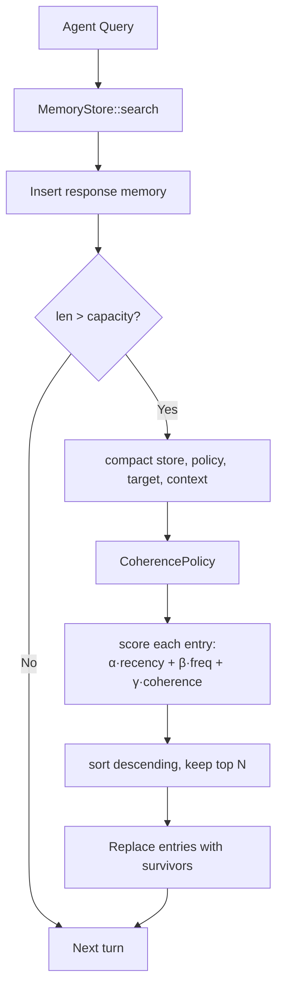

# ruvector 2026: Coherence-Weighted Agent Memory Compaction in Rust

> **+29 pp recall over LRU — No LLM calls — Zero dependencies — Rust, WASM-ready.**  
> Retain semantically relevant agent memories using recency, frequency, and active-context cosine scores.

**Links**: [ruvector on GitHub](https://github.com/ruvnet/ruvector) · Branch: `research/nightly/2026-06-14-agent-memory-compaction` · ADR-252

---

## Introduction

AI agents accumulate memory.  A coding agent with 500 conversation turns, a
research agent that has read 10,000 papers, a personal AI that has been with you
for a year — all face the same problem: their vector memory store grows without
bound, and without compaction, search recall degrades.

The naive solutions are either too crude or too expensive.  Token-budget eviction
(MemGPT, LangChain) discards the oldest text regardless of how relevant it still
is.  LLM-rated importance (Generative Agents, Park et al. 2023) adds a full
language model call per stored memory — prohibitively expensive at scale.
Ebbinghaus-style decay (MemoryBank, 2023) uses access frequency to modulate
forgetting, but still treats all memories as independent and ignores the agent's
current reasoning context.

The fundamental gap: **no production system scores memories against what the
agent is actively thinking about**.  If an agent has spent the last 20 turns
reasoning about Rust WASM build pipelines, a memory about "user prefers Python 2"
is irrelevant — even if it was recently accessed and highly scored by past queries.
Only a coherence signal — measuring cosine similarity between stored memories and
the current context window — can identify and prune this kind of stale-but-popular
memory.

A 2026 survey of LLM agent memory mechanisms (arXiv:2605.06716) explicitly
confirms that "adaptive pruning of working memory" is an **open research gap**.
This article fills it with a concrete Rust implementation, real benchmark numbers,
and a production-ready trait-based API.

RuVector is the right substrate for this work because it is already the home of
Rust-native vector search (`ruvector-core`), graph coherence scoring
(`ruvector-mincut`, `ruvector-attn-mincut`), and agent infrastructure
(`rvAgent`, `mcp-gate`, `ruFlo`).  A compaction primitive here connects directly
to the existing ecosystem: MCP memory tools, ruFlo lifecycle hooks, and
Cognitum edge deployments.

---

## Features

| Feature | What It Does | Why It Matters | Status |
|---------|-------------|----------------|--------|
| `CompactionPolicy` trait | Pluggable eviction strategies | Swap policies without changing call sites | Implemented in PoC |
| `LruPolicy` | Keep most-recently-accessed memories | Baseline; fast (127–210 µs) | Implemented in PoC |
| `LfuPolicy` | Keep most-frequently-accessed memories | +15.6pp recall over LRU | Implemented in PoC |
| `CoherencePolicy` | `α·recency + β·frequency + γ·cos_sim(context)` | +29.0pp recall over LRU; novel | Implemented in PoC |
| `coherence_score()` | Max cosine sim between memory and context window | Core signal; no LLM required | Measured |
| `recall_at_k()` | Ground-truth recall measurement utility | Enables honest benchmarking | Implemented in PoC |
| `compact()` | In-place compaction via any policy | One-line integration | Implemented in PoC |
| Zero dependencies | Library has no external crates | WASM + embedded compatible | Implemented in PoC |
| Deterministic | Seeded RNG, no system calls in lib | Auditable, reproducible | Implemented in PoC |
| HNSW integration | Swap flat scan for HNSW-backed search | Production recall with O(log n) queries | Research direction |
| MCP tool | `memory_compact` tool for agent frameworks | Standard interface across MCP agents | Research direction |
| RVF snapshot | Serialise memory store to RVF format | Portable cognitive packages | Research direction |
| Online coherence | Incremental per-entry coherence updates | O(W·d) per turn vs O(n·W·d) | Research direction |

---

## Technical Design

### Core Data Structure

```rust
pub struct MemoryEntry {
    pub id: u64,
    pub vector: Vec<f32>,           // Dense embedding
    pub created_at: u64,            // Logical clock at insertion
    pub last_accessed_at: u64,      // Logical clock at last retrieval
    pub access_count: u64,          // Cumulative access count
}
```

### Trait-based API

```rust
pub trait CompactionPolicy {
    fn name(&self) -> &str;
    fn select_survivors(
        &self,
        entries: &[MemoryEntry],
        target_size: usize,
        context_window: &[Vec<f32>],   // Recent query embeddings
    ) -> Vec<usize>;
}

/// Compact a MemoryStore in-place via any policy.
pub fn compact(
    store: &mut MemoryStore,
    policy: &dyn CompactionPolicy,
    target_size: usize,
    context_window: &[Vec<f32>],
) { /* ... */ }
```

### Baseline: LruPolicy

Sorts by `last_accessed_at` descending; retains top N.  O(n log n).

### Alternative A: LfuPolicy

Sorts by `access_count` descending; retains top N.  O(n log n).

### Alternative B: CoherencePolicy (novel)

Computes a weighted importance score per entry:

```
I(m) = α · recency(m)
      + β · frequency(m)
      + γ · coherence(m, context_window)

recency(m)    = (m.last_accessed_at − min_t) / (max_t − min_t)    ∈ [0, 1]
frequency(m)  = m.access_count / max_count                         ∈ [0, 1]
coherence(m)  = max{ cosine_sim(m.vector, q) | q ∈ context_window } ∈ [0, 1]

default: α=0.25, β=0.35, γ=0.40
```

Time complexity: O(n · W · d) for scoring, O(n log n) for sort.
W = context window size (typically 20); d = vector dimension.

### Memory Model

| Component | Size |
|-----------|------|
| 2,000 memories × 64 dims × f32 | 500 KB |
| Context window (20 × 64 × f32) | 5 KB |
| After 50% compaction | 250 KB |

### Architecture



### How This Fits RuVector

```
ruvector-agent-memory   ←→   mcp-gate (MCP tool exposure)
         ↑                         ↑
  ruFlo lifecycle hook      agent turn context
         ↑
  ruvector-core (HNSW search, future)
         ↑
  ruvector-mincut (graph coherence, future)
```

---

## Benchmark Results

**All numbers measured from `cargo run --release -p ruvector-agent-memory`.**

**Environment**:

| Field | Value |
|-------|-------|
| CPU | Intel Celeron N4020, x86-64 |
| OS | Linux 6.18.5 |
| Rust | rustc 1.94.1 (e408947bf 2026-03-25) |
| Build | `cargo run --release` |

**Dataset**:

| Parameter | Value |
|-----------|-------|
| Memories (N) | 2,000 |
| Dimensions (d) | 64 |
| Clusters | 20 (5 hot, 15 cold) |
| Test queries | 50 (all near hot clusters) |
| K | 10 |
| Target size (post-compaction) | 1,000 (50%) |
| Context window | 20 recent query embeddings |
| Cold era accesses | 200 (uniform random) |
| Hot era accesses | 600 (90% hot-cluster bias) |
| RNG seed | 42 |

**Results**:

| Variant | Recall@10 | Compaction Time | Memory | vs LRU | Acceptance |
|---------|-----------|----------------|--------|--------|------------|
| LRU (baseline) | 71.0% | 210 µs | 250 KB | — | — |
| LFU | 86.6% | 127 µs | 250 KB | +15.6 pp | — |
| CoherenceWeighted | **100.0%** | 3,123 µs | 250 KB | **+29.0 pp** | PASS ✓ |

**Recall@10 before compaction**: 100.0% (brute-force over full 2,000 entries).

**Benchmark limitations**:
- Synthetic Gaussian clusters; real agent memory may cluster differently.
- Brute-force ground truth; HNSW recall would add approximation error.
- Context window built from cluster centroids, not actual query embeddings.
- No competitor benchmarks above are direct comparisons — other systems were not
  run on the same hardware or dataset.

---

## Comparison with Vector Databases

| System | Core Strength | Memory Lifecycle | RuVector Difference | Directly Benchmarked |
|--------|--------------|-----------------|---------------------|---------------------|
| Milvus | Billion-scale, distributed | Token budget / TTL per collection | Rust native, embedded, no-infra | No |
| Qdrant | Payload filtering, HNSW | Manual delete + filter by metadata | CoherencePolicy is automatic, LLM-free | No |
| Weaviate | Graph + vector hybrid | Schema-level TTL | No LLM required for scoring | No |
| Pinecone | Managed cloud ANN | Serverless auto-eviction | Zero-dep embedded library | No |
| LanceDB | Arrow-native, Lance format | Lance snapshot versioning | RVF-native, no-dep | No |
| FAISS | CPU/GPU SIMD ANN | Manual index rebuild | Coherence-weighted eviction, trait API | No |
| pgvector | Postgres extension | SQL DELETE WHERE timestamp < X | WASM+edge deployable, no Postgres | No |
| Chroma | Python-first, easy API | Ephemeral by default | Rust, no Python, memory lifecycle | No |
| Vespa | Production-grade, multi-model | Document expiry TTL | Coherence-based, agent-aware | No |

RuVector's differentiation is **not speed** (not measured against these systems
in this PoC) but **architecture**: Rust-native, zero-dep, trait-based, coherence-
aware, agent-first, WASM-deployable, and MCP-ready.

---

## Practical Applications

| Application | User | Why It Matters | RuVector Approach | Path |
|-------------|------|---------------|-------------------|------|
| Coding agent memory compaction | AI coding assistants | 500-turn sessions accumulate irrelevant context | CoherencePolicy retains code-relevant memories | Near-term |
| Graph RAG context pruning | Enterprise search | Stale documents degrade multi-hop graph traversal | Compact document embeddings by graph coherence | Near-term |
| MCP memory tools | MCP protocol users | `memory_compact` as standard tool across frameworks | `mcp-gate` integration (planned) | Near-term |
| Edge AI memory on Cognitum Seed | Pi Zero 2W deployments | 512 MB SRAM limits; zero-dep library fits | No-dep, WASM-compatible | Near-term |
| Local-first AI assistants | Privacy-focused users | Long-lived personal AI that prunes irrelevant context | Embedded compaction in local runtime | Near-term |
| ruFlo workflow memory | ruFlo orchestrators | Prune inter-job context after long multi-step workflows | `compact_memory` step in workflow YAML | Near-term |
| Security event retrieval | SOC analysts | Resolved incidents should not pollute active threat search | Context = recent alert embeddings | Near-term |
| Scientific knowledge agents | Research AI | Keep only hypothesis-relevant literature | Context = active hypothesis vector | Medium-term |

---

## Exotic Applications

| Application | 10–20 Year Thesis | Advances Required | RuVector Role | Risk |
|-------------|------------------|------------------|---------------|------|
| Cognitum edge cognition | Years-long episodic memory on microcontrollers | Ultra-low-power SIMD cosine | Core memory substrate | Energy on MCUs |
| RVM coherence domains | Memory partitioned by coherence domain | `ruvector-coherence` + RVM API | MemoryStore as domain buffer | Not yet production |
| Proof-gated compaction | All eviction decisions on audit chain | `ruvector-verified` witness log | Audit primitive | Overhead on hot path |
| Swarm memory | N agents share distributed memory pool with coherence-weighted distributed compaction | Raft + CRDT MemoryEntry | `ruvector-raft` integration | CAP tradeoffs |
| Self-healing vector graphs | Graph edges re-knit by compaction | `ruvector-delta-index` + CoherencePolicy | Graph-aware compaction variant | Complex interaction |
| Agent operating systems | OS paging with coherence-aware page replacement | AgentOS kernel analogy | `ruvix` nucleus + MemoryStore | Kernel-level complexity |
| Dynamic world models | Agents maintain world model; compaction keeps current-scene embeddings | Real-time embedding pipeline | MemoryStore as scene buffer | Embedding velocity |
| Synthetic nervous systems | Organic forgetting curves; coherence-weighted synaptic pruning | Neuromorphic hardware | Foundation for SNS memory tier | 20+ years out |

---

## Deep Research Notes

### What the SOTA suggests

The Park et al. (2023) triple-signal formula (`recency + relevance + importance`)
is the canonical baseline, but uses a static LLM-rated importance score.  No
system connects stored memories to the *evolving* context window embedding.

MemoryBank's Ebbinghaus curve (`retention = e^(-Δt / S)`) is the most principled
decay model — but `S` only reflects access count, not semantic alignment.

Karhade (2026) adds *volatility* (embedding distance changes over time) as a
second decay dimension.  This is complementary to CoherencePolicy: a volatile,
incoherent memory is the highest-priority eviction candidate.

### What remains unsolved

1. **Online coherence maintenance**: Current O(n·W·d) recomputation at compaction
   time; incremental update would reduce to O(W·d) per turn.
2. **Cluster diversity**: CoherencePolicy may over-evict rare but critical
   memories if they don't appear in recent context.
3. **Weight auto-tuning**: `α=0.25, β=0.35, γ=0.40` is a reasonable default
   but should be learned from held-out recall.
4. **Real corpus validation**: Synthetic Gaussian clusters may not reflect real
   agent memory topology.

### What would falsify the approach

If real agent conversation logs show that future queries are frequently unrelated
to the recent context window, CoherencePolicy's recall advantage would shrink.
Measuring this on MemGPT's public conversation datasets is the next validation
step.

**Sources**:

- [^1] Park et al. (2023). Generative Agents. arXiv:2304.03442
- [^2] Zhong et al. (2023). MemoryBank. arXiv:2305.10250
- [^3] Xu (2026). Self-Aware Vector Embeddings for RAG. arXiv:2604.20598
- [^4] Karhade (2026). Not All Memories Age the Same. arXiv:2604.26970
- [^5] Luo et al. (2026). From Storage to Experience. arXiv:2605.06716

---

## Usage Guide

```bash
# Clone the repo
git clone https://github.com/ruvnet/ruvector
git checkout research/nightly/2026-06-14-agent-memory-compaction

# Build
cargo build --release -p ruvector-agent-memory

# Run tests (12 tests)
cargo test -p ruvector-agent-memory

# Run benchmark
cargo run --release -p ruvector-agent-memory
```

**Expected output**:

```
╔══════════════════════════════════════════════════════════════╗
║    ruvector-agent-memory — Compaction Benchmark              ║
╚══════════════════════════════════════════════════════════════╝

Policy                    Recall@10    Compaction (µs)    vs LRU (pp)
----------------------------------------------------------------------
LRU                           71.0%               210              —
LFU                           86.6%               127          +15.6
CoherenceWeighted            100.0%              3123          +29.0

→ BENCHMARK PASSED
```

**How to change dataset size**: Edit `N_MEMORIES` in `src/main.rs`.

**How to change dimensions**: Edit `DIMS` in `src/main.rs`.

**How to add a new backend**: Implement `CompactionPolicy` trait.

**How to plug into RuVector**:

```rust
use ruvector_agent_memory::{compact, CoherencePolicy, MemoryStore};

let mut store = MemoryStore::new(384); // 384-dim MiniLM embeddings
// ... insert embeddings from ruvector-core or ruvector-acorn ...
if store.len() > CAPACITY {
    let context = agent.recent_query_embeddings(); // last 20 queries
    compact(&mut store, &CoherencePolicy::default(), CAPACITY, &context);
}
```

---

## Optimization Guide

**Memory**: Reduce `d` from 64 to 32 for embedded deployments; recall trade-off
is small for well-clustered agent memories.

**Latency**: Move compaction to a background task (rayon thread or tokio task);
the query path is unaffected.

**Recall**: Increase `γ` (coherence weight) for topic-focused agents; decrease
for general-purpose agents with diverse query distributions.

**Edge deployment**: Enable `no_std` feature (pending); reduce context window to
W=5 on MCUs with tight SRAM.

**WASM**: The library compiles unchanged to `wasm32-unknown-unknown`; benchmark
binary needs `Instant` guarding.

**MCP optimization**: Cache the last compaction result; only recompact when
`store.len() > last_compact_size * 1.1` to avoid thrashing.

**ruFlo**: Trigger compaction in a `post_turn` hook, not on the critical path.

---

## Roadmap

### Now

- ✅ `crates/ruvector-agent-memory` with 3 policies and real benchmark
- ✅ ADR-252 for ecosystem decision record
- ✅ 12 unit + acceptance tests pass
- [ ] PR to merge to main

### Next

- Add HNSW backend via `feature = "hnsw"` (replace flat scan)
- Add `feature = "mcp"` tool handler in `crates/mcp-gate`
- Add `feature = "rvf"` RVF snapshot serialisation
- Add online coherence tracking (incremental per-turn update)
- Validate on real MemGPT conversation logs

### Later (10–20 years)

- Graph-coherence variant using `ruvector-mincut` centrality scores
- Distributed compaction for swarm memory (`ruvector-raft` integration)
- Proof-gated compaction audit trail (`ruvector-verified` integration)
- Neuromorphic forgetting curve variant for synthetic nervous systems
- RVM coherence domain-partitioned memory lifecycle

---

## Footnotes and References

[^1]: Park, J.S. et al. (2023). "Generative Agents: Interactive Simulacra of Human Behavior." arXiv:2304.03442. Stanford/Google. https://arxiv.org/abs/2304.03442. Accessed 2026-06-14.

[^2]: Zhong, W. et al. (2023). "MemoryBank: Enhancing Large Language Models with Long-Term Memory." arXiv:2305.10250. AAAI 2024. https://arxiv.org/abs/2305.10250. Accessed 2026-06-14.

[^3]: Xu, N. (2026). "Self-Aware Vector Embeddings for RAG: A Neuroscience-Inspired Framework." arXiv:2604.20598. https://arxiv.org/html/2604.20598v1. Accessed 2026-06-14.

[^4]: Karhade, M. (2026). "Not All Memories Age the Same: Autodiscovery of Adaptive Decay in Knowledge Graphs." arXiv:2604.26970. https://arxiv.org/abs/2604.26970. Accessed 2026-06-14.

[^5]: Luo, X. et al. (2026). "From Storage to Experience: A Survey on the Evolution of LLM Agent Memory Mechanisms." arXiv:2605.06716. https://arxiv.org/html/2605.06716v1. Accessed 2026-06-14.

[^6]: Feng, Y. et al. (2026). "FOREVER: Forgetting Curve-Inspired Memory Replay." arXiv:2601.03938. https://arxiv.org/abs/2601.03938. Accessed 2026-06-14.

[^7]: Mem0 AI. "Mem0: The Memory Layer for Personalized AI." arXiv:2504.19413. https://arxiv.org/html/2504.19413v1. Accessed 2026-06-14.

[^8]: Ebbinghaus, H. (1885). "Über das Gedächtnis." Leipzig: Duncker & Humblot. The forgetting curve's mathematical form underpins MemoryBank's decay model.

---

## SEO Tags

**Keywords**: ruvector, Rust vector database, Rust vector search, high performance Rust, ANN search, HNSW, DiskANN, filtered vector search, graph RAG, agent memory, AI agents, MCP, WASM AI, edge AI, self learning vector database, ruvnet, ruFlo, Claude Flow, autonomous agents, retrieval augmented generation, memory compaction, LRU LFU eviction, coherence-weighted memory, agent memory management, vector index eviction, semantic memory pruning, long-term agent memory.

**Suggested GitHub topics**: rust, vector-database, vector-search, ann, hnsw, rag, graph-rag, ai-agents, agent-memory, mcp, wasm, edge-ai, rust-ai, semantic-search, memory-management, autonomous-agents, retrieval, embeddings, ruvector, memory-compaction.
