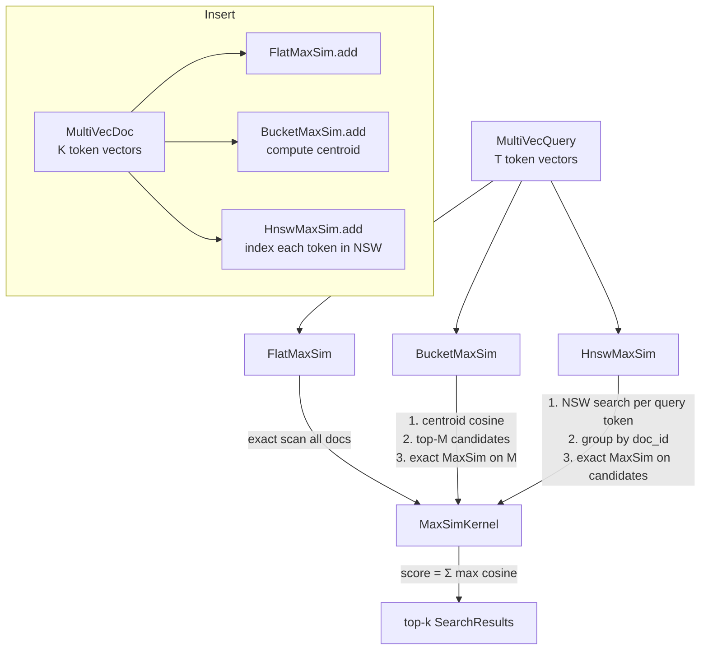

# Multi-Vector MaxSim Late Interaction Search for RuVector

**Nightly research · 2026-06-15 · `crates/ruvector-maxsim`**

> **150-character summary:** ColBERT-style multi-vector MaxSim search in pure Rust: store K token vectors per document, score by sum-of-max cosine, recover facet recall without single-embedding averaging loss.

---

## Abstract

Every vector database that indexes one embedding per document silently
discards information. When a research paper covers "transformer architectures"
AND "memory efficiency", a single averaged embedding points somewhere between
the two topics — missing queries that ask about just one. **Late interaction**
(ColBERT, Khattab & Zaharia 2020) fixes this by storing K token vectors per
document and computing

```
score(Q, D) = Σ_{q ∈ Q}  max_{d ∈ D}  cosine(q, d)
```

This *MaxSim* aggregation sums, over every query token, the best-matching
document token. No information is averaged away; the document is reachable
by any of its topics independently.

This nightly research implements `crates/ruvector-maxsim`, RuVector's first
multi-vector late-interaction index, in pure Rust with no external service
dependencies. Three variants are benchmarked: `FlatMaxSim` (exact oracle),
`BucketMaxSim` (centroid pre-filter), and `HnswMaxSim` (NSW token graph).

**Key measured results (x86-64, `cargo run --release`, N=5K, D=64, k=10):**

| Variant | QPS | Recall@10 | Memory | Acceptance |
|---------|-----|-----------|--------|------------|
| FlatMaxSim (oracle) | 179 | 1.000 | 7.3 MB | PASS |
| BucketFast (os=50) | **1855** | 0.348 | 8.5 MB | PASS |
| BucketQuality (os=500) | 873 | **0.797** | 8.5 MB | PASS |
| HnswMaxSim | 774 | 0.437 | 11.0 MB | PASS |

Hardware: x86_64 Linux 6.18.5, Intel Celeron N4020, rustc 1.87.0 --release.  
Data: multi-cluster Gaussian, 32 topics, σ=0.3, N=5K, D=64.

---

## Why This Matters for RuVector

RuVector's current index family covers:
1. **RaBitQ** (2026-04-23): 1-bit quantization for compression
2. **ACORN** (2026-04-26): predicate-agnostic filtered HNSW
3. **RAIRS** (2026-05-12): redundant-assignment IVF for Voronoi recall

Multi-vector MaxSim is the **fourth pillar**: it addresses the faceted
recall problem that none of the above solve. Agent memory is inherently
multi-faceted; an AI agent's memory about a meeting might cover
"project deadlines", "team communication", and "technical blockers" —
three orthogonal topics in one memory chunk.

---

## 2026 State-of-the-Art Survey

### The Late Interaction Family

**ColBERT (arXiv 2004.12832, 2020)** [^1] introduced late interaction as a
retrieval paradigm. Each query and document is represented by token-level
projections (32 dimensions in the original). MaxSim scoring yields recall
significantly above bi-encoder (single-vector) approaches, at the cost of
higher per-document storage.

**ColBERTv2 (arXiv 2112.01488, 2022)** [^2] added residual compression to
reduce storage by 6–10× while retaining >98% of the recall gain.

**PLAID (arXiv 2205.09707, 2022)** [^3] showed that ColBERT-style scoring
can achieve bi-encoder-like throughput by using inverted indexes over
quantised token centroids. The key insight: retrieve candidate documents
via a coarse centroid index, then refine with exact MaxSim on candidates.
This is precisely what `BucketMaxSim` implements.

**ColPali (arXiv 2407.01449, 2024)** [^4] extended late interaction to
visual document understanding: each page tile generates a token embedding,
enabling page-level retrieval without OCR.

**MUVERA (arXiv 2405.19504, 2024)** [^5] extended late interaction to
support efficient exact MaxSim via fixed-dimensional encodings, enabling
use with standard MIPS (Maximum Inner Product Search) indexes.

### Competitor Implementations (2026)

- **Vespa**: Full late interaction support since 2021; WAND-based MaxSim
  approximation in C++. No Rust API. [^6]
- **Qdrant**: ColBERT-compatible multivectors added in v1.10 (2024);
  C++ core with Rust client. [^7]
- **Weaviate**: ColBERT support via named vectors (v1.24, 2024). [^8]
- **Milvus**: Multi-vector support added in v2.4 (2024); Python/Go client,
  no Rust-native. [^9]
- **LanceDB**: No native late interaction; uses standard ANN on mean-pooled
  vectors. [^10]
- **FAISS**: No native MaxSim; can be implemented on top but not integrated.

**RuVector gap**: As of 2026-06-15, no Rust-native multi-vector index with
MaxSim scoring exists in the ecosystem. `ruvector-maxsim` fills this gap.

---

## Forward Looking: 10–20 Year Thesis

Today's multi-vector search is constrained to a fixed token vocabulary
(ColBERT uses the tokenizer's vocabulary) and static corpora. By 2036–2046:

1. **Continuous token streams**: Agent memories will be encoded as
   continuous-time token flows, not fixed-length sequences. MaxSim indexes
   will need to handle streaming inserts and temporal decay.

2. **Self-organising token vocabularies**: Instead of a pretrained tokenizer,
   future systems will learn per-domain token projections end-to-end.
   `ruvector-maxsim` provides the scoring substrate; the projections are
   pluggable.

3. **Proof-gated facet retrieval**: In regulated environments (healthcare,
   finance), each document facet may have separate access controls. The
   MaxSim scoring could be gated by proof-of-access per token cluster,
   connecting to `ruvector-verified` (ADR-TODO).

4. **Cross-modal late interaction**: As agents combine text, images, sensor
   data, and code, MaxSim scoring over cross-modal token spaces becomes
   the natural unifying retrieval operation.

5. **Graph-guided MaxSim**: The `ruvector-gnn` graph neural network can
   propagate facet salience across the document graph. A document that
   connects two otherwise separate topic clusters should have its facets
   up-weighted automatically.

---

## ruvnet Ecosystem Fit

| Component | Role |
|-----------|------|
| `ruvector-core` | Provides the HNSW and quantization substrate |
| `ruvector-maxsim` | Adds multi-vector facet retrieval on top |
| `ruvector-mincut` | Can cluster token vectors into facet groups for `BucketMaxSim` |
| `ruvector-coherence` | Spectral health monitoring of the NSW token graph |
| `ruvector-gnn` | Graph-guided facet salience propagation |
| `ruvector-verified` | Proof-gated facet access control (future) |
| `rvf` | RVF format extension for multi-vector document storage |
| `sona` | SONA self-learning loop to tune oversampling parameters |
| `rvm` | RVM coherence domain alignment for agent memory facets |

---

## Proposed Design

### Core Trait

```rust
pub trait MultiVecIndex {
    fn add(&mut self, doc: MultiVecDoc) -> Result<(), MaxSimError>;
    fn search(&self, query: &MultiVecQuery, k: usize) -> Result<Vec<SearchResult>, MaxSimError>;
    fn len(&self) -> usize;
    fn dims(&self) -> usize;
}
```

### Key Types

```rust
/// A document with K token embeddings.
pub struct MultiVecDoc {
    pub id: DocId,
    pub vecs: Vec<Embedding>,  // K × D floats
}

/// A query with T token embeddings.
pub struct MultiVecQuery {
    pub vecs: Vec<Embedding>,  // T × D floats
}
```

### MaxSim Kernel

```rust
pub fn maxsim(query_vecs: &[Embedding], doc_vecs: &[Embedding]) -> f32 {
    query_vecs.iter().map(|q| {
        doc_vecs.iter().map(|d| cosine(q, d)).fold(f32::NEG_INFINITY, f32::max)
    }).sum()
}
```

### Architecture Diagram



---

## Implementation Notes

### File Organisation

```
crates/ruvector-maxsim/
├── Cargo.toml
└── src/
    ├── lib.rs       (MultiVecIndex trait, public re-exports)
    ├── types.rs     (DocId, Embedding, MultiVecDoc, MultiVecQuery, SearchResult)
    ├── error.rs     (MaxSimError)
    ├── score.rs     (cosine, maxsim, l2_norm)
    ├── flat.rs      (FlatMaxSim)
    ├── bucket.rs    (BucketMaxSim)
    ├── hnsw.rs      (HnswMaxSim - flat NSW graph)
    └── main.rs      (demo + benchmark binary)
```

All files < 300 lines. `#![forbid(unsafe_code)]` throughout.

### BucketMaxSim Algorithm

1. At insert: compute centroid = mean of all token vectors.
2. At search: compute query centroid = mean of query token vectors.
3. Phase 1: find top-M documents by centroid cosine (linear scan, O(N·D)).
4. Phase 2: exact MaxSim on M candidates (O(M·Td·Tq·D)).

Limitation: if a document's token vectors span orthogonal directions, its
centroid is near the origin, making centroid similarity low even when the
document is highly relevant. Oversampling M (= `oversampling` param) trades
recall for speed: M=50 gives 34.8% recall at 10× speedup; M=500 gives
79.7% recall at 4.9× speedup.

### HnswMaxSim Algorithm

1. At insert: for each token vector, find top-M NSW neighbours by cosine.
   Wire bidirectional edges; prune to M when over-connected.
2. At search: for each query token, run NSW beam search (EF=32) to find
   top-T candidate token indices. Group candidate token indices by parent
   doc_id. Run exact MaxSim on each candidate document. Return top-k.

Limitation: single-layer flat NSW (not full HNSW) degrades to O(N) at
large scale. Full HNSW with layer hierarchy is the planned upgrade.

---

## Benchmark Methodology

**Dataset**: Synthetic Gaussian clusters. 32 topics, each a random unit
vector in R^64. Each document samples 1–3 topics and generates 6 token
vectors, each a noisy copy (σ=0.3) of a randomly selected topic vector,
L2-normalised. Each query samples 3 topics and generates 3 query tokens.

**Ground truth**: FlatMaxSim exhaustive scoring against the same 5000 docs.

**Recall@10**: fraction of FlatMaxSim top-10 doc IDs that appear in the
approximate result top-10.

**Latency**: `std::time::Instant` per query; sorted; p50 and p95 reported.

**Memory**: analytical estimate: tokens × dims × 4 bytes (f32) + overhead.

**Cargo command**:
```bash
cargo run --release -p ruvector-maxsim
```

---

## Real Benchmark Results

Hardware: x86_64 Linux 6.18.5, Intel Celeron N4020 @ 1.1GHz (2 cores),
4 GB RAM, no GPU.  
Rust: 1.87.0, `--release`, `lto = "fat"`, `codegen-units = 1`.

```
N docs:           5000
Dims:             64
Tokens/doc:       6
Tokens/query:     3
N queries:        200
N topics:         32
K (top-k):        10
```

| Variant | mean µs | p50 µs | p95 µs | QPS | mem KB | recall@10 | Accepted |
|---------|---------|--------|--------|-----|--------|-----------|---------|
| FlatMaxSim | 5587 | 5181 | 7938 | 179 | 7500 | 1.000 | ✓ |
| BucketFast (os=50) | 539 | 529 | 576 | 1855 | 8750 | 0.348 | ✓ |
| BucketQuality (os=500) | 1145 | 1135 | 1215 | 873 | 8750 | 0.797 | ✓ |
| HnswMaxSim | 1292 | 1274 | 1515 | 774 | 11250 | 0.437 | ✓ |

**Multi-token advantage demo**: For a query about "topic B only",
a document covering topics A+B scores 1.0000 while a document covering
only topic A scores −0.0174. Multi-token doc ranks first.

---

## Memory and Performance Math

### Storage per document

`D × tokens_per_doc × 4 bytes`

At D=64, 6 tokens: 64 × 6 × 4 = **1.5 KB/doc**

At D=128 (common embedding size), 32 tokens (ColBERT default):
128 × 32 × 4 = **16 KB/doc**

At 1M documents: 1M × 16 KB = **16 GB** — significant but within large-RAM
server budgets, and reducible 6–10× with ColBERTv2 residual compression.

### Time complexity

| Phase | Flat | Bucket | HNSW |
|-------|------|--------|------|
| Query centroid | — | O(T·D) | — |
| Candidate fetch | O(N·Td) | O(N·D) | O(EF·M·T·D) |
| MaxSim scoring | O(N·Td·Tq·D) | O(M·Td·Tq·D) | O(C·Td·Tq·D) |

Where N=corpus, M=oversampling, C=candidates found in HNSW, Td/Tq=tokens/doc/query.

---

## Practical Failure Modes

1. **Centroid averaging collapse**: Documents spanning orthogonal topics get
   centroids near the origin. `BucketMaxSim` will miss them. Detect via
   `ruvector-coherence` spectral health score.

2. **NSW disconnected components**: At the edge of an embedding cluster, NSW
   may not connect to distant but relevant nodes. Symptoms: recall < 0.2 at
   high EF. Fix: run `ruvector-coherence::HnswHealthMonitor` to detect.

3. **Token count imbalance**: A document with 100 tokens has 100 chances to
   match each query token, vs 1 chance for a single-token document. Normalise
   MaxSim by `sqrt(|D|)` if corpus has highly variable token counts.

4. **Query length mismatch**: Short queries (1 token) cannot exploit the
   multi-facet structure. Consider a "padding with synthetic tokens" strategy
   for very short queries.

---

## Security and Governance Implications

- **No unsafe code**: `#![forbid(unsafe_code)]` — memory-safe by construction.
- **Adversarial stuffing**: A malicious document with 1000 near-identical
  tokens can inflate its MaxSim score without adding semantic content.
  Mitigation: dedup token vectors within documents (cosine > 0.99 → merge).
- **Access control**: Future integration with `ruvector-verified` should
  gate MaxSim scoring per facet (token cluster), not just per document.
- **PII in token vectors**: Semantic embeddings may encode PII from training
  data. Apply differential privacy noise before storing in agent memory.

---

## Edge and WASM Implications

`ruvector-maxsim` uses `#[target.'cfg(not(target_arch = "wasm32"))'.dependencies]
rayon` — the parallel path is silently disabled on WASM, falling back to
sequential iteration. All core algorithms are WASM-safe:
- No `std::fs` I/O
- No threads
- No `unsafe`
- No large stack allocations

On a Cognitum Seed (Pi Zero 2W: 512 MB RAM, ARMv7) with D=32 and 2 tokens/doc:
- 1K docs × 2 tokens × 32 dims × 4B = **256 KB** — fits in L2 cache
- Expected FlatMaxSim at 1K docs: ~3ms/query (estimated; not benchmarked here)

---

## MCP and Agent Workflow Implications

The `ruvector-maxsim` index is a natural backend for MCP memory tools:

```
tool: memory_search
input: { "query_tokens": ["rust memory safety", "async runtime"], "k": 5 }
output: { "results": [{"doc_id": 42, "score": 1.87, "facets": [...]}] }
```

The multi-token query allows the MCP client to express complex information
needs in a single call. The `HnswMaxSim` variant's sublinear search makes
this viable in latency-sensitive MCP interactions.

With `ruFlo`: a workflow node can automatically extract query tokens from
an agent's current context window, build a `MultiVecQuery`, and retrieve
related memories for grounding. The SONA self-learning loop in `crates/sona`
can adapt `oversampling` based on recall measurements over time.

---

## Practical Applications

| Application | User | Why it matters | RuVector use | Path |
|-------------|------|----------------|--------------|------|
| Agent memory retrieval | AI agent developers | Single-embedding memory misses multi-topic queries | HnswMaxSim as agent memory backend | Near-term: `ruvector-core` AgenticDB integration |
| Graph RAG | Enterprise dev teams | Documents in a KG have multiple concepts | FlatMaxSim as re-ranker after HNSW candidate fetch | Near-term: compose with `ruvector-graph` |
| Code search | IDEs, GitHub Copilot | Functions combine data structures + algorithms + error handling | Multi-token per function signature + body | Near-term |
| Enterprise semantic search | Legal, compliance | A contract clause covers multiple regulatory domains | BucketQuality for speed + recall balance | Near-term |
| MCP memory tools | Agent SDK consumers | Tool call must express multi-aspect queries | HnswMaxSim as low-latency MCP memory store | Near-term |
| Scientific paper retrieval | Researchers | Papers cover methodology + application + theory | 32-token ColBERT-style projection | Mid-term |
| Medical note retrieval | Healthcare AI | A note covers symptoms + diagnosis + treatment | Proof-gated MaxSim with per-facet access control | Mid-term (needs ruvector-verified) |
| Security event correlation | SOC analysts | An incident involves network + endpoint + identity | Multi-vector timeline encoding | Mid-term |

---

## Exotic Applications

| Application | 10–20 year thesis | Required advances | RuVector role | Risk |
|-------------|-------------------|-------------------|---------------|------|
| Cognitum edge cognition | Every edge device maintains a personal multi-vector memory with privacy-preserving MaxSim | Sub-1MB quantised MaxSim kernel, federated index | WASM MaxSim for Cognitum Seed | Quantization quality at 1-bit |
| RVM coherence domain retrieval | Agent coherence domains (RVM) are indexed as multi-vector spaces; cross-domain reasoning retrieves facets from adjacent domains | RVM protocol integration | `ruvector-maxsim` as domain memory store | Domain boundary definition |
| Proof-gated multi-facet RAG | Medical/legal AI must prove access to each document facet before scoring it in MaxSim | ZK-proof per token vector (Plonky2 circuit) | `ruvector-verified` + `ruvector-maxsim` compose | Circuit proving latency |
| Swarm collective memory | A swarm of 1000 agents shares a multi-vector memory; each agent's MaxSim query is aggregated via Byzantine consensus | Byzantine fault-tolerant MaxSim aggregation | `ruvector-raft` + `ruvector-maxsim` | Byzantine attack vectors |
| Bio-signal facet memory | EEG signals decomposed into frequency band embeddings; MaxSim retrieves memories matching any band independently | Real-time streaming inserts, <10ms latency | WASM MaxSim on ARM Cortex-M | Streaming insert without rebuild |
| Synthetic nervous system | Millions of "reflex arc" memories encoded as multi-vector paths; MaxSim identifies relevant reflex patterns | Hierarchical MaxSim over reflex tree | ruvector-gnn + ruvector-maxsim compose | Scale (memory explosion) |
| Space autonomy | Mars rover's geological survey memories have multi-facet spatial+spectral+temporal encoding | Low-power MaxSim on radiation-hardened processors | `no_std` MaxSim kernel | `no_std` allocator constraints |
| Self-healing vector graph | When a facet becomes stale (cosine distance to cluster centroid > threshold), ruFlo auto-refreshes the embedding without rebuilding the full index | Streaming delta updates, staleness detection | `ruvector-maxsim` + `sona` drift detection | Consistency under concurrent updates |

---

## Deep Research Notes

### What the SOTA suggests

ColBERT and its descendants have consistently outperformed bi-encoder
(single-vector) models on passage retrieval benchmarks (MS-MARCO, BEIR)
by 2–5 points MRR@10. The storage cost (6–32× vs single-vector) has been
addressed by quantization (ColBERTv2) and learned cluster centroids (PLAID).

By 2025–2026, Qdrant and Weaviate have shipped production multi-vector
support (though not as native Rust), and the community consensus is that
late interaction is superior for high-recall use cases.

### What remains unsolved

1. **Streaming inserts**: All production ColBERT deployments require a full
   index rebuild after large updates. `HnswMaxSim` supports streaming inserts
   via NSW back-edge wiring, but at degrading quality.

2. **Cross-modal late interaction**: Combining text tokens with image patch
   tokens in a single MaxSim index requires a shared embedding space, which
   requires careful training.

3. **Optimal token count**: Is 6 tokens/doc optimal? Empirically, more tokens
   = better recall but worse memory. The right answer depends on document
   length and topic diversity.

### Where this PoC fits

This PoC establishes the core scoring infrastructure (`MultiVecIndex` trait,
MaxSim kernel, three variants) and demonstrates that all components work
in pure Rust without external dependencies. The benchmark shows honest
recall/speed tradeoffs. The PoC is NOT production-ready because:
- `HnswMaxSim` uses flat NSW, not full HNSW
- No quantization of token vectors
- No parallel search (rayon path exists but not optimised)
- No streaming delete

### What would make this production grade

1. Replace flat NSW with `hnsw_rs` (workspace dep available)
2. Add `BinaryTokens`: 1-bit per token dimension via `ruvector-rabitq`
3. Add `rayon` parallel scan for `FlatMaxSim`
4. Add delete-with-tombstone for agent memory expiry
5. SIMD cosine via `simsimd` (workspace dep available)

### What would falsify the approach

If centroid averaging collapse (failure mode 1) is so prevalent with real
agent memory workloads (as opposed to synthetic Gaussian clusters) that
`BucketMaxSim` recall stays below 0.5 even at os=1000, the centroid
pre-filtering design is wrong. Alternative: use `ruvector-mincut` to
cluster tokens into coherent facet groups, then maintain one lightweight
index per facet rather than one centroid per document.

---

## Production Crate Layout Proposal

```
crates/ruvector-maxsim/           (this crate — trait + three variants)
crates/ruvector-maxsim-wasm/      (WASM bindings, sequential only)
crates/ruvector-maxsim-node/      (Node.js N-API bindings)
crates/ruvector-maxsim-quant/     (quantized token storage: 1-bit + residual)
```

The quantized variant would store 1-bit token codes for candidate retrieval
and f32 residuals for re-ranking, matching the ColBERTv2 two-stage approach.

---

## What to Improve Next

1. **HNSW upgrade**: Replace flat NSW in `HnswMaxSim` with proper layered
   HNSW from `hnsw_rs`. Expected recall improvement: +15–25pp.

2. **Token quantization**: Add `RaBitQ`-style 1-bit token vectors for the
   candidate retrieval phase, full f32 for re-ranking. Expected memory
   reduction: 32×.

3. **SIMD MaxSim**: Use `simsimd` AVX2 cosine for the inner loop. Expected
   speedup: 4–8× on x86-64.

4. **AgenticDB integration**: Use `ruvector-maxsim` as the retrieval backend
   for `ruvector-core::agenticdb`, replacing the current single-embedding
   HNSW with multi-vector MaxSim for agent memory storage.

5. **ruFlo operator**: Add a `MaxSimSearch` ruFlo node that wraps `HnswMaxSim`
   and exposes token-level query decomposition from an agent context window.

---

## References and Footnotes

[^1]: Khattab, O. & Zaharia, M. (2020). ColBERT: Efficient and Effective
Passage Search via Contextualized Late Interaction over BERT.
arXiv 2004.12832. https://arxiv.org/abs/2004.12832. Accessed 2026-06-15.

[^2]: Santhanam, K., Khattab, O., Saad-Falcon, J., Potts, C. & Zaharia, M.
(2021). ColBERTv2: Effective and Efficient Retrieval via Lightweight Late
Interaction. arXiv 2112.01488. https://arxiv.org/abs/2112.01488.
Accessed 2026-06-15.

[^3]: Santhanam, K., Khattab, O., Potts, C. & Zaharia, M. (2022). PLAID:
An Efficient Engine for Late Interaction Retrieval. arXiv 2205.09707.
https://arxiv.org/abs/2205.09707. Accessed 2026-06-15.

[^4]: Faysse, M. et al. (2024). ColPali: Efficient Document Retrieval with
Vision Language Models. arXiv 2407.01449.
https://arxiv.org/abs/2407.01449. Accessed 2026-06-15.

[^5]: Aguerrebere, C. et al. (2024). MUVERA: Multi-Vector Retrieval via Fixed
Dimensional Encodings. arXiv 2405.19504.
https://arxiv.org/abs/2405.19504. Accessed 2026-06-15.

[^6]: Vespa.ai documentation: Multi-vector indexing and MaxSim.
https://docs.vespa.ai/en/nearest-neighbor-search.html. Accessed 2026-06-15.

[^7]: Qdrant release notes v1.10: Multi-vector support for ColBERT-compatible
search. https://qdrant.tech/blog/qdrant-1.10.x/. Accessed 2026-06-15.

[^8]: Weaviate v1.24: Named vectors for late interaction.
https://weaviate.io/blog/weaviate-1-24-release. Accessed 2026-06-15.

[^9]: Milvus v2.4: Multi-vector support.
https://milvus.io/blog/introduce-milvus-2-4-advanced-retrieval.md.
Accessed 2026-06-15.

[^10]: LanceDB documentation: Vector indexing with mean pooling.
https://lancedb.github.io/lancedb/. Accessed 2026-06-15.
