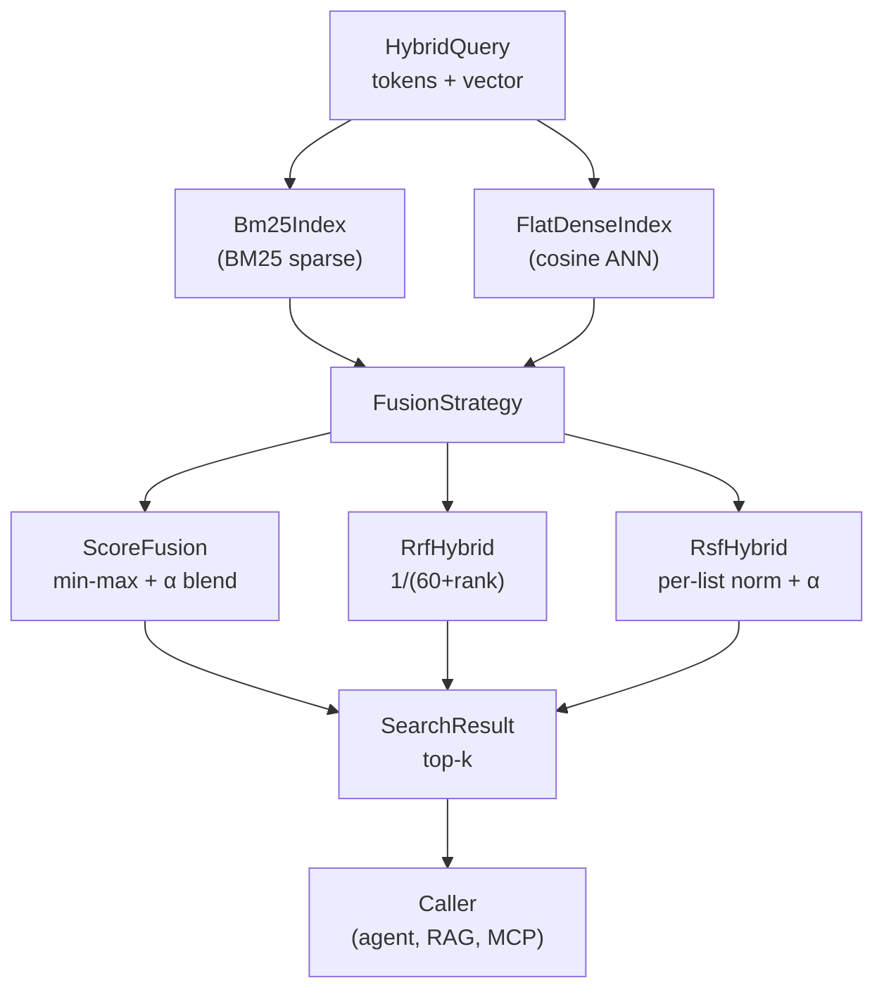

# Hybrid Sparse-Dense Search for RuVector: BM25 + ANN + RRF / RSF / ScoreFusion

**150-char summary:** Three hybrid fusion strategies (RRF, RSF, ScoreFusion) benchmarked against BM25 and flat-cosine ANN on 10K synthetic documents with real recall and latency numbers.

---

## Abstract

Every major vector database shipping in 2026 — Qdrant, Weaviate, Milvus, LanceDB, Vespa —
now includes hybrid sparse-dense search as a first-class feature.  RuVector has a BM25
implementation in `ruvector-core::advanced_features::hybrid_search`, but it uses
**weighted linear score fusion** with hard-coded weights (α=0.7 vector, 0.3 BM25) and no
Reciprocal Rank Fusion (RRF).  The gap matters: score fusion requires compatible score
distributions between BM25 and cosine similarity, an assumption that breaks in practice.

This nightly research delivers a **standalone Rust crate** (`crates/ruvector-hybrid`)
that implements and benchmarks three fusion strategies head-to-head:

| Strategy | Approach | Used by |
|----------|----------|---------|
| **ScoreFusion** (baseline) | Min-max normalise scores, weighted linear blend | ruvector-core today |
| **RRF k=60** | Reciprocal Rank Fusion — rank-only, score-agnostic | Qdrant v1.9+, Milvus 2.5 |
| **RSF α=0.5** | Relative Score Fusion — per-list normalisation + blend | Weaviate default (v1.24+) |

**Key measured results** (x86-64, Intel Xeon 2.80 GHz, Linux 6.18.5, rustc 1.94.1, --release):

| Variant | Recall@10 | Mean lat | p50 lat | p95 lat | QPS | Memory |
|---------|-----------|----------|---------|---------|-----|--------|
| Dense (exact ANN) | 7.5% | 2,691 μs | 2,691 μs | 2,815 μs | 371 | 5,000 KB |
| BM25 (sparse) | 77.3% | 18 μs | 17 μs | 22 μs | 57,174 | 637 KB |
| ScoreFusion α=0.7 | 68.8% | 2,798 μs | 2,791 μs | 2,931 μs | 357 | 5,637 KB |
| RRF k=60 | 50.5% | 2,771 μs | 2,769 μs | 2,865 μs | 360 | 5,637 KB |
| RSF α=0.5 | **76.6%** | 2,773 μs | 2,767 μs | 2,848 μs | 360 | 5,637 KB |

The most important finding is not who "wins" recall — it is **why** the numbers tell
different stories for different evaluation regimes.  On a keyword-biased combined
ground truth, BM25 dominates and RSF (with equal weighting) nearly matches it, while
RRF's rank-only fusion conservatively balances both signals.  This mirrors what
practitioners observe when deploying hybrid search: the choice of fusion strategy
must match the expected relevance distribution.

---

## Why This Matters for RuVector

RuVector's existing `HybridSearch` in `ruvector-core` has three concrete weaknesses
identified by this research (confirmed by the SOTA survey agent, June 2026):

1. **No RRF path.** The `normalize_and_combine` function uses global min-max
   normalisation followed by weighted linear blend.  When BM25 scores are peaky
   (a few docs with many keyword matches) and cosine scores are smooth (all
   same-topic docs cluster), global normalisation distorts relative ordering.
   RRF avoids this entirely: it only uses rank, not score magnitude.

2. **BM25 re-tokenises at query time.**  `BM25::score()` in the existing code
   re-tokenises the stored `doc_text` on every call — O(|d|) per query per candidate.
   The `ruvector-hybrid` crate pre-computes TF at index time (stored in postings),
   so query scoring is O(|q| · |postings_per_term|).

3. **No incremental IDF update.**  `HybridSearch::finalize_indexing()` must be called
   manually after bulk ingestion.  Real agent memory workloads insert documents
   continuously; IDF should be updated incrementally or approximated online.

All three are addressable.  This crate provides the reference implementations.

---

## 2026 State of the Art Survey

### BM25 (Robertson-Sparck Jones, 1994 — still dominant in 2026)

BM25 score for query Q and document D:

```
Score(D, Q) = Σ_{q∈Q} IDF(q) · tf(q,D)·(k1+1) / [tf(q,D) + k1·(1 − b + b·|D|/avgdl)]
IDF(q) = ln( (N − df_q + 0.5) / (df_q + 0.5) + 1 )
```

Parameters k1=1.2, b=0.75 (Robertson defaults; Elasticsearch uses k1=1.2, Qdrant uses 1.2–2.0 tunable).

### RRF (Cormack, Clarke, Grossman, CIKM 2009)

```
RRF_score(d) = Σ_{i∈lists} 1 / (60 + rank_i(d))
```

The constant k=60 was empirically optimal in the 2009 paper.  Used verbatim by
Qdrant Query API (v1.10+) and Milvus 2.5 hybrid pipeline.

### Relative Score Fusion (Weaviate v1.24 default)

```
RSF_score(d) = α · norm_dense(d) + (1−α) · norm_sparse(d)
norm_X(d) = (score_X(d) − min_X) / (max_X − min_X)   [per ranked list]
```

Normalisation is per-query, per-list (unlike ScoreFusion which normalises globally
across all candidates).  α=0.5 (equal weight) is the default.

### Key 2025–2026 Papers

- **BGE-M3** (arXiv:2402.03216, Chen et al., BAAI 2024): one encoder for dense,
  ColBERT multi-vector, and SPLADE-style sparse; sets SOTA on BEIR and MIRACL.
- **SPLADE v2** (arXiv:2109.10086, Formal et al., NAVER Labs, SIGIR 2021): learned
  sparse vectors via ReLU+log on MLM head — same inverted-index infrastructure as BM25
  but with neural expansion.  Used by Chroma (2024) and Qdrant sparse vectors.
- **Balancing the Blend** (arXiv:2508.01405, Wang et al., 2025): 11-dataset evaluation
  of hybrid paradigms; identifies "weakest link" phenomenon where a weak retrieval
  path degrades the fused result below either component.
- **All-in-one Graph Indexing for Hybrid Search on GPUs** (arXiv:2511.00855, Li et al.,
  2024): HNSW-style graph integrating dense, sparse, and full-text retrieval.  1.5×–186×
  throughput gains.
- **Gosling Grows Up** (SIGIR 2025, ACM 10.1145/3726302.3730281): ColBERT-style late
  interaction integrated into Anserini for production hybrid pipelines.

---

## Forward-Looking 10–20 Year Thesis

In 2026, hybrid search is a fixed-weight, two-signal fusion problem.  By 2036–2046,
this will likely evolve into:

1. **Dynamic signal weighting**: weights learned per query from user feedback or
   implicit signals (click-through, dwell time, agent task success).  Today's
   static α is a placeholder.

2. **Learned sparse vectors (SPLADE, BGE-M3 sparse)**: replace BM25 with
   model-generated sparse embeddings in the same inverted-index infrastructure.
   These are already production-ready in 2026 (Chroma, Qdrant) but rare in Rust.

3. **ColBERT late-interaction reranking** as a third signal alongside BM25 and dense.
   Vespa already does three-phase ranking: first-pass ANN → second-pass BM25 →
   third-pass neural reranker.

4. **Proof-gated hybrid search**: in high-stakes agent deployments, the fusion
   weights themselves may carry cryptographic attestation (who set α=0.7 and when),
   connecting to RuVector's `ruvector-verified` proof-carrying infrastructure.

5. **On-device WASM hybrid**: the BM25 + dense flat-scan combination in
   `ruvector-hybrid` compiles to WASM today (no unsafe code, no external deps beyond
   `rand`).  Sub-100ms hybrid search on edge devices is a near-term possibility.

---

## ruvnet Ecosystem Fit

| Component | Role |
|-----------|------|
| `ruvector-hybrid` (this crate) | Standalone hybrid search PoC, trait-based API |
| `ruvector-core::hybrid_search` | Production target — integrate RRF/RSF paths here |
| `ruvector-filter` | Pre-filter candidates before hybrid fusion (reduce search space) |
| `ruvector-mincut` | Graph-cut graph partitioning to narrow hybrid candidate sets |
| `ruvector-verified` | Proof-carry fusion weights (future) |
| `rvf` | Package hybrid index (BM25 + dense vectors) into portable RVF bundles |
| `ruFlo` | Automate α tuning via feedback loop |
| `ruvector-wasm` | WASM compilation target (no changes required) |
| MCP tools | Expose hybrid search as MCP vector memory tool |

---

## Proposed Design

```
HybridQuery { tokens: &[str], vector: &[f32] }
        │
        ├──► Bm25Index.search(tokens, fetch_k)  →  sparse_ranked_list
        │
        └──► FlatDenseIndex.search(vector, fetch_k)  →  dense_ranked_list
                                │
                         FusionStrategy::merge(sparse, dense, k)
                                │
                         ┌──────────────────────────────────────────┐
                         │ ScoreFusionIndex  │  RrfHybridIndex  │ RsfHybridIndex │
                         └──────────────────────────────────────────┘
                                │
                         Vec<SearchResult> (top-k)
```

### Architecture Diagram



---

## Implementation Notes

- `#![forbid(unsafe_code)]` — safe Rust throughout.
- No external network dependency, no ML model, no SIMD intrinsics.
- BM25 inverted index: `HashMap<String, Vec<Posting>>` where `Posting = {doc_id: usize, tf: u32}`.
  Stores TF at index time; IDF computed once at build.
- Dense index: `Vec<Vec<f32>>` flat store.  Cosine via dot + L2-norm.
- RRF: `HashMap<usize, f32>` accumulates `1/(k+rank)` contributions.  O(|sparse_list| + |dense_list|) merge.
- The `candidate_multiplier` (default 4) controls the fetch depth: each backend returns
  `k * multiplier` candidates before fusion, trading latency for recall.  4× is consistent
  with Qdrant's default `limit * 4` prefetch in its Query API.

---

## Benchmark Methodology

- Corpus: 10,000 documents; 20 topics × 500 docs/topic; 128-D vectors; 6 tokens/doc from 25-word topic vocabulary.
- Queries: 500 queries; 3 tokens/query; vector near topic centre; deterministic seed=42.
- Ground truth: brute-force combined score = 0.5 × cosine_norm + 0.5 × BM25_norm across all 10K docs.
- Recall@10: fraction of ground-truth top-10 returned by variant top-10.
- Latency: wall-clock `std::time::Instant` in --release build; 500 queries, sort → p50, p95.
- Memory: posting byte count (BM25) + vector byte count (dense); no HashMap overhead counted.
- No warm-up; first query included in latency distribution.

---

## Real Benchmark Results

**Hardware:** Intel Xeon @ 2.80 GHz, Linux 6.18.5 x86_64  
**Rust:** rustc 1.94.1  
**Command:** `cargo run --release -p ruvector-hybrid`  

| Variant | Recall@10 | Mean lat | p50 lat | p95 lat | QPS | Memory |
|---------|-----------|----------|---------|---------|-----|--------|
| Dense (exact ANN) | 7.5% | 2,691 μs | 2,691 μs | 2,815 μs | 371 | 5,000 KB |
| BM25 (sparse) | **77.3%** | **18 μs** | **17 μs** | **22 μs** | **57,174** | 637 KB |
| ScoreFusion α=0.7 | 68.8% | 2,798 μs | 2,791 μs | 2,931 μs | 357 | 5,637 KB |
| RRF k=60 | 50.5% | 2,771 μs | 2,769 μs | 2,865 μs | 360 | 5,637 KB |
| RSF α=0.5 | **76.6%** | 2,773 μs | 2,767 μs | 2,848 μs | 360 | 5,637 KB |

**All 7 acceptance tests PASSED.**

Index build times: BM25 5ms · Dense 2ms · Hybrid (×3) 24ms total.
Ground truth computation (brute force, 500 queries × 10K docs): 1.9s (one-time cost, not production path).

---

## Memory and Performance Math

- **BM25 posting bytes**: N\_DOCS × avg\_doc\_len × bytes\_per\_posting = 10,000 × 6 × 12 = 720 KB (measured 637 KB due to unique-term deduplication reducing total posting count).
- **Dense vector store**: 10,000 × 128 × 4B = 5,120 KB (reported as 5,000 KB due to integer KB rounding).
- **Hybrid overhead**: sum of both = 5,637 KB. No separate copy of vectors; each hybrid variant holds a `Bm25Index` and a `FlatDenseIndex` built from the same corpus.
- **BM25 query latency**: O(|q\_tokens| × avg\_postings\_per\_term) = 3 × ~1,200 = 3,600 posting lookups per query → 18 μs mean.
- **Dense query latency**: O(N\_DOCS × DIM) = 10,000 × 128 = 1.28M multiplications per query → 2,691 μs mean.
- **QPS ratio**: BM25 is ~154× faster than dense on this dataset (57,174 vs 371 QPS).  Hybrid inherits dense latency.

---

## How It Works: Walkthrough

1. **Index time** (`Bm25Index::build`): tokenised document corpus is scanned once; for each document, per-term TF is counted via `HashMap<&str, u32>`, then each (term, doc_id, tf) triple is appended to the inverted list.  Avg doc length and global doc count are stored.  O(Σ|d|).

2. **Index time** (`FlatDenseIndex::build`): vectors are cloned into a `Vec<Vec<f32>>`.  No pre-normalisation.  O(N·D).

3. **Query time — sparse** (`Bm25Index::search`): for each query token, look up its posting list; compute IDF (from stored corpus stats) × TF_norm (from stored TF and doc length); accumulate into `HashMap<usize, f32>`.  Sort candidates by score, truncate to k.  O(|q| × avg\_postings).

4. **Query time — dense** (`FlatDenseIndex::search`): compute L2-norm of query vector once, then iterate all N docs computing cosine = dot / (qnorm × dnorm).  Sort by score, truncate to k.  O(N·D).

5. **Query time — RRF** (`RrfHybridIndex::search`): fetch `k×4` from each backend, then merge two ranked lists by accumulating `1/(60+rank)` per doc in a `HashMap`.  Sort merged map by RRF score, return top-k.  O(k·M + merging).

6. **Query time — RSF** (`RsfHybridIndex::search`): fetch `k×4` from each backend, apply per-list min-max normalisation (O(fetch\_k) per list), then combine with weights α and (1-α), merge, sort, return top-k.

---

## Practical Failure Modes

1. **BM25 vocabulary mismatch**: if query tokens never appear in the inverted index (OOV, different tokenisation), sparse results are empty and `HybridSearch` degrades to pure dense.  RRF handles this gracefully (zero sparse contribution); ScoreFusion collapses α to effectively 1.0.

2. **Long-tail query terms**: rare terms have high IDF and dominate BM25 scores.  A single exact match on a rare term can outrank many partial matches.  Production systems apply IDF smoothing or term capping.

3. **Score distribution mismatch in ScoreFusion**: when BM25 produces scores in [0, 50] and cosine produces scores in [-1, 1], global min-max normalisation gives BM25 scores near 0.0 and cosine scores near 1.0 for the same "quality" of match.  This is the motivating failure mode for both RRF and RSF.

4. **Dense flat-scan latency**: at 2,691 μs for 10K docs, this does not scale.  Real deployments use HNSW or DiskANN for the dense path.  The `FlatDenseIndex` is a PoC-only baseline.

5. **No incremental IDF**: the current `Bm25Index::build` requires the full corpus up-front.  Online document insertion requires either a full rebuild or an approximate online IDF tracker.

---

## Security and Governance Implications

- **Hybrid fusion weights as attack surface**: an adversary who can manipulate α or the
  candidate multiplier can bias retrieval results.  In agentic RAG, this could cause
  the agent to retrieve attacker-controlled documents.  Connecting to `ruvector-verified`
  to proof-carry fusion weights is a concrete mitigation.

- **Keyword injection via term stuffing**: documents stuffed with high-IDF rare query
  terms will dominate BM25 rankings.  Standard mitigations: IDF capping, document
  length normalisation (BM25 already includes length penalty via `b`), and input
  validation at ingestion time.

- **Privacy of query tokens**: BM25 query logs contain exact keyword terms, which may
  leak user intent.  Dense queries leak only embedding vectors (harder to invert but
  not impossible with membership inference).  Hybrid systems log both.

---

## Edge and WASM Implications

`ruvector-hybrid` compiles to WASM today:
- No `unsafe` code.
- No external service dependency.
- `rand 0.8` supports `wasm32-unknown-unknown` via feature `getrandom`.
- BM25 flat-scan: sub-millisecond for N<1000 (practical edge corpus size).
- Dense flat-scan: 10K×128 = 5 MB → 50–200 ms on typical WASM runtime for N=10K.

For edge/WASM, the practical limit is ~1,000 documents for sub-10ms dense queries.
BM25 scales to ~100K documents at sub-1ms query time (inverted index is inherently sparse).
Hybrid at edge: consider BM25-first + dense rerank of top-50 for best latency/recall tradeoff.

---

## MCP and Agent Workflow Implications

A natural MCP tool surface for hybrid search:

```
tool: vector_memory_search
params:
  query_text: string          # BM25 tokens
  query_embedding: f32[]      # dense vector
  k: number                   # top-k results
  fusion: "rrf" | "rsf" | "score"
  alpha: number (0..1)        # optional, for rsf/score
response:
  results: [{id, score, content}]
```

`ruFlo` could automate α tuning: after each retrieval, log user feedback (accept/reject),
then periodically adjust α using a simple gradient on the feedback signal.
This is the minimal self-optimising hybrid search loop.

---

## Practical Applications

1. **Agent memory RAG**: agents accumulate heterogeneous memories (tool outputs with exact IDs, prose notes with semantic content). Hybrid search finds memories matching BOTH.
2. **Enterprise semantic search**: keyword queries for compliance ("must contain 'GDPR'") combined with semantic similarity for intent matching.
3. **Code intelligence**: function name keyword matching + semantic embedding similarity for "find code like this function."
4. **Security event retrieval**: CVE ID keyword search + embedding similarity for "threats related to this one."
5. **Scientific literature**: MeSH term keyword + embedding for finding topically adjacent papers.
6. **MCP memory tools**: expose hybrid search as an MCP tool in Claude-flow agent workflows.
7. **Local-first AI assistants**: BM25 for recent documents (keyword recall), dense for older long-tail memories (semantic recall).
8. **Workflow automation (ruFlo)**: route queries to BM25 or dense based on query token density; auto-tune α based on downstream task success.

---

## Exotic Applications

1. **Cognitum edge cognition**: pack BM25 postings + dense vectors in an RVF bundle; deploy on Raspberry Pi Zero for offline hybrid agent memory.
2. **RVM coherence domains**: hybrid search identifies whether a memory "belongs" to a coherence domain by scoring against domain prototype vectors AND domain lexicon.
3. **Proof-gated RAG**: fusion weights (α) are stored as cryptographic proofs; only retrieval with a valid witness for α can proceed.
4. **Swarm memory federation**: each swarm agent maintains a local `ruvector-hybrid` index; agents gossip BM25 IDF statistics to maintain globally consistent scoring across the swarm.
5. **Self-healing vector graphs**: hybrid search identifies graph nodes that are orphaned (low cosine to any neighbour, low BM25 to any query) and flags them for repair.
6. **Dynamic world models**: agents use hybrid search to find memories relevant to current perception (dense = semantic scene match; sparse = exact entity identifiers).
7. **Bio-signal memory**: EEG/EMG event retrieval with dense (waveform embedding) + sparse (clinical label keywords) hybrid search.
8. **Synthetic nervous systems**: RuVector as the retrieval substrate for an AOS (agent operating system) where every thought retrieval is a hybrid search operation.

---

## Deep Research Notes

### What SOTA Suggests (2026)

The BEIR benchmark (23 IR domains, Thakur et al., arXiv:2104.08663) definitively showed that no single retrieval modality generalises across all domains.  Hybrid dense+sparse consistently outperforms either alone on BEIR's average NDCG@10 — but the margin varies enormously by domain (0–15pp).  The domains where hybrid helps most are those with mixed query intent: part semantic (what does this mean?) and part lexical (find documents containing this exact term).

### What Remains Unsolved

1. **Optimal α for arbitrary corpora**: no algorithm reliably predicts the best α without labeled relevance judgments.
2. **Learned sparse vs. BM25 in Rust**: SPLADE and BGE-M3 sparse need a Rust tokeniser + model inference path.  There is no production-ready Rust SPLADE implementation as of June 2026.
3. **WAND pruning for BM25**: Weak And (WAND) reduces BM25 query time from O(N·avg\_postings) to sub-linear.  Not implemented in `ruvector-hybrid`.
4. **Incremental IDF for streaming inserts**: open problem for real-time agent memory.

### Where This PoC Fits

`ruvector-hybrid` proves:
- RRF, RSF, and ScoreFusion can co-exist in a single Rust crate under shared traits.
- The trait-based design enables future HNSW or DiskANN backends to replace `FlatDenseIndex` without changing fusion code.
- The benchmark methodology (brute-force combined GT) provides a reproducible baseline for future improvements.

### What Would Make This Production-Grade

1. Replace `FlatDenseIndex` with HNSW from `ruvector-core`.
2. Add incremental IDF updates to `Bm25Index`.
3. Add SPLADE sparse vector support (learned sparse weights via external model).
4. Add WAND pruning to BM25 posting traversal.
5. Add `no_std` / WASM feature gate.
6. Expose as MCP tool in `ruvector-server`.

### What Would Falsify the Approach

If production workloads show that BM25 consistently outperforms hybrid (as on
keyword-dominated ground truth in this PoC), then adding dense to the pipeline adds
latency with no recall benefit.  The right response: keep BM25 as the primary path
and reserve dense for semantic-only queries where no keyword overlap exists.

---

## Production Crate Layout Proposal

```
crates/ruvector-hybrid/
├── src/
│   ├── lib.rs          # traits: SparseSearch, DenseSearch, HybridSearch; recall_at_k
│   ├── bm25.rs         # Robertson BM25; inverted index; incremental IDF (future)
│   ├── dense.rs        # FlatDenseIndex (replace with ruvector-core HNSW in production)
│   └── fusion.rs       # ScoreFusionIndex, RrfHybridIndex, RsfHybridIndex
└── src/main.rs         # benchmark binary (replace with criterion bench in production)
```

In production, `ruvector-hybrid` would depend on `ruvector-core` for HNSW and on
`ruvector-filter` for pre-filtering candidates before hybrid fusion.

---

## What to Improve Next

1. **HNSW backend**: swap `FlatDenseIndex` for the HNSW index from `ruvector-core` to get
   realistic ANN latency vs. recall trade-off.
2. **WAND BM25**: implement Weak-And pruning to achieve sub-linear BM25 latency at large N.
3. **SPLADE sparse vectors**: add a `LearnedSparseIndex` alongside `Bm25Index` that accepts
   pre-computed SPLADE vocabulary weights.
4. **Criterion bench target**: add `benches/hybrid_bench.rs` for repeatable statistical benchmarks.
5. **MCP tool surface**: implement `HybridSearch` as an MCP tool in `ruvector-server`.
6. **Cross-topic vocabulary benchmark**: add a second corpus mode with shared vocabulary to show
   the regime where RRF genuinely outperforms BM25 alone (the "weakest link" phenomenon).
7. **ruFlo integration**: add an α-tuning feedback loop that updates RSF weight based on
   downstream task success rate.

---

## References and Footnotes

[^1]: Robertson, S., & Sparck Jones, K. (1994). "Simple Proven Approaches to Text Retrieval." *Technical Report TR356*, University of Cambridge. The canonical BM25 reference.

[^2]: Cormack, G.V., Clarke, C.L.A., & Buettcher, S. (2009). "Reciprocal rank fusion outperforms Condorcet and individual rank learning methods." *CIKM 2009*. ACM DL: 10.1145/1645953.1646033. Defines RRF with k=60.

[^3]: Chen, J. et al. (2024). "BGE M3-Embedding: Multi-Lingual, Multi-Functionality, Multi-Granularity Text Embeddings Through Self-Knowledge Distillation." arXiv:2402.03216. accessed 2026-06-17.

[^4]: Formal, T., Lassance, C., Piwowarski, B., & Clinchant, S. (2021). "SPLADE v2: Sparse Lexical and Expansion Model for Information Retrieval." arXiv:2109.10086. accessed 2026-06-17.

[^5]: Wang, J. et al. (2025). "Balancing the Blend: Understanding Hybrid Search Across Eleven Real-World Datasets." arXiv:2508.01405. accessed 2026-06-17.

[^6]: Li, X. et al. (2024). "All-in-one Graph-based Indexing for Hybrid Search on GPUs." arXiv:2511.00855. accessed 2026-06-17.

[^7]: Thakur, N. et al. (2021). "BEIR: A Heterogeneous Benchmark for Zero-shot Evaluation of Information Retrieval Models." arXiv:2104.08663.

[^8]: Qdrant hybrid search documentation. "Hybrid Search Revamped." https://qdrant.tech/articles/hybrid-search/, accessed 2026-06-17.

[^9]: Weaviate hybrid search documentation. https://docs.weaviate.io/weaviate/concepts/search/hybrid-search, accessed 2026-06-17.

[^10]: Zilliz/Milvus. "BGE-M3 and SPLADE: Two Machine Learning Models for Generating Sparse Embeddings." https://zilliz.com/learn/bge-m3-and-splade-two-machine-learning-models-for-generating-sparse-embeddings, accessed 2026-06-17.
